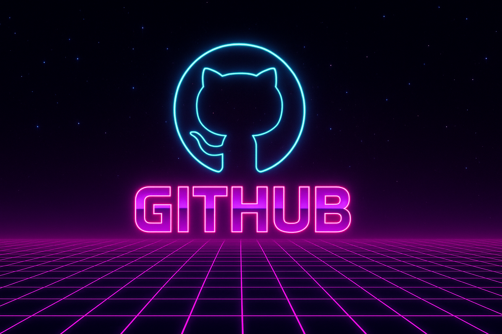

<!-- Retro 80s Banner -->

  

<h1 align="center">👾 Hey, I'm Gary!</h1>

  💻 <b>Front-End Developer</b> | 🌍 Based in Ireland  
   🎯 Currently learning through <a href="https://www.theodinproject.com/" target="_blank">The Odin Project</a>  
   ⚡ Focused on mastering HTML, CSS, and JavaScript  
   🚀 Passionate about crafting responsive, fast, and visually engaging web experiences

---

### 🧠 What I’m Learning
- 🌐 **HTML5** – the structure behind every great website  
- 🎨 **CSS3** – turning design into pixel-perfect layouts  
- ⚡ **JavaScript** – bringing interactivity and logic to life  
- 🧩 **Version Control (Git & GitHub)** – collaborating and tracking progress  

---

### 🧱 Projects
Here’s what I’ve been working on:

- 🖥️ [**Portfolio Website**](https://yourwebsite.com) – my personal site showcasing skills & projects  

*(More coming soon — follow my journey as I build and learn!)*

---

### 🛠️ Tech Stack

  
  
  
  
  
  

---

### 📊 GitHub Stats

  
  

---

  

---

  ✨ <i>“Code, create, and keep learning — one commit at a time.”</i>

