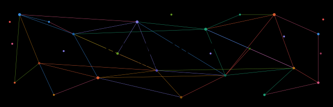

1| 
2| 
3| <h1 align="center">👾 Hey, I'm Gary!</h1>
4| 
5| 

6|   💻 <b>Front-End Developer</b> | 🌍 Based in Ireland  
7|    🎯 Currently learning through <a href="https://www.theodinproject.com/" target="_blank">The Odin Project</a>  
8|    ⚡ Focused on mastering HTML, CSS, and JavaScript  
9|    🖥️ Enthusiastic <b>homelabber</b> running self-hosted applications with <b>Docker</b>  
10|    🚀 Passionate about crafting responsive, fast, and visually engaging web experiences
11| 

12| 
13| ---
14| 
15| ### 🧠 What I'm Learning
16| -  **HTML5** – the structure behind every great website  
17| -  **CSS3** – turning design into pixel-perfect layouts  
18| -  **JavaScript** – bringing interactivity and logic to life  
19| -   **Version Control** – managing projects with Git & GitHub  
20| -  **Docker** – containerizing and running applications in my homelab  
21| -  **TryHackMe** – learning cybersecurity through hands-on labs and guided courses  
22| -  **PreSecurity** – completed and built my foundation in cyber fundamentals  
23| -  **Security 101** – currently learning core security concepts and best practices  
24| 
25| ---
26| 
27| ### 🧱 Projects
28| Here's what I've been working on:
29| 
30| - 🖥️ [**Portfolio Website**](https://garychamp.github.io/MyMainWebsite/index.html) – my personal site showcasing skills & projects  
31| - 🌤️ [**Weather App**](link) – a dynamic weather application
32| - 🎨 [**Etch a Sketch**](link) – an interactive drawing canvas
33| - 🧮 [**Calculator**](link) – a functional calculator application
34| - ✅ [**To Do App**](link) – a task management application
35| 
36| ---
37| 
38| ### 🛠️ Tech Stack
39| 
40| 

41|   
42|   
43|   
44|   
45|   
46|   
47|   
48| 

49| 
50| ---
51| 
52| 

53|   
54| 

55| 
56| ---
57| 
58| 

59|   ✨ <i>"Code, create, and keep learning — one commit at a time."</i>
60| 

61| 